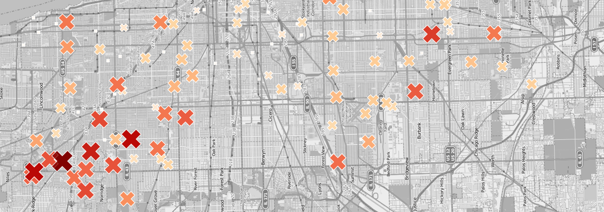
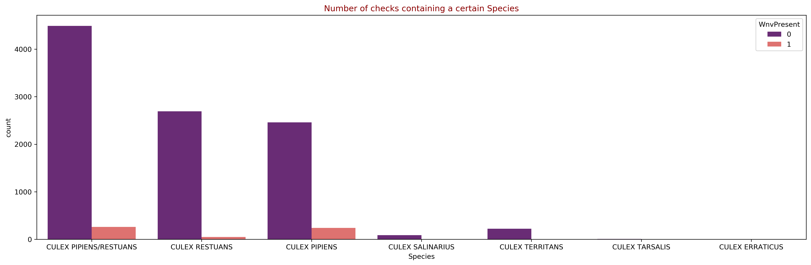
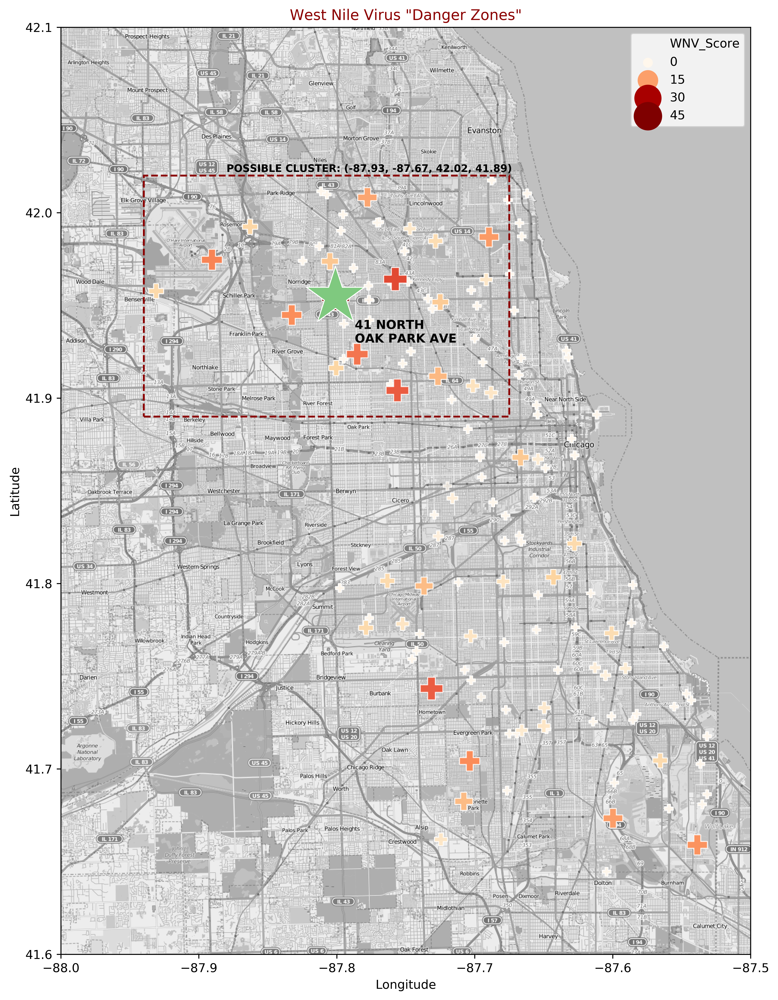
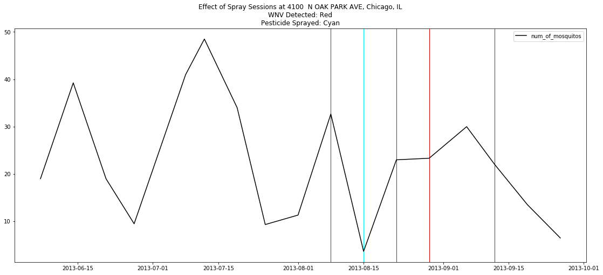
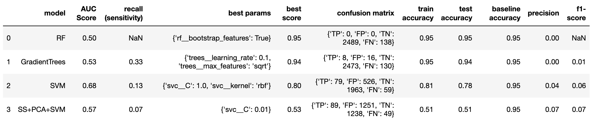

# WNV_Prediction

 

# Predicting West Nile Virus cases with Data Science

---

### Finding/Fighting the Virus
The West Nile Virus(WNV) is a scourge plaguing Chicago. In 2018, there were 176 reported cases and 17 resultant deaths from the virus. 

Using Data analysis and machine learning classifiers like Random Forests and Logistic Regression, we seek to find out the most important factors (eg. Wind, temperature, pesticide use, etc.) that determine the presence of WNV in any given district in the Windy City.


### Background
West Nile virus is transmitted through the bite of various subspecies of the Culex mosquito. Common symptoms include fever, nausea, headache and muscle aches. Symptoms may last from a few days to a few weeks. However, four out of five people infected with West Nile virus will not show any symptoms. In rare cases, severe illness including meningitis, or even death, can occur. 

### Data Visualisation
 

**Mosquito Species and WNV**

> *In our training dataset, Culex Pipiens and Restuans are the main carriers of the virus.*  



**Seeking out worst-hit addresses**

> *We engineered a WNV Score to find the most "dangerous" Addresses. The score was created by multiplying the percentage of WNV-positive checks by the number of times the place has been a "repeat offender" (i.e. WNV found on a seperate year).*



**Evaluating the effectiveness of pesticide use**

> Not all instances of pesticide use resulted in a fall in the number of mosquitos. But pesticide use did result in eradicating West Nile Virus presence, with the exception of one particularly pesticide-resistant location....41 North Oak Park Ave.

### Datasets
We have four different data sets that we're working with for this project:

**train.csv & test.csv** - These datasets contain information from several checks on different neighbourhoods in Chicago(10506 and 116293 respectively). The latter dataset is does not contain information about whether the cases are WNV cases or not. This will be the data set used to validate our model. The results will be submitted to a Kaggle competition. 

**spray.csv** - This dataset contains time and location details of 14835 pesticide spraying operations all over Chicago city. 

**weather.csv** - As the proliferation of mosquitos has to do with weather conditions, we will also be using data from a detailed dataset containing information of 2944 days from 2007 to 2014.

```
Project 4: Predicting West Nile Virus cases with Datascience
|__ Cleaning.ipynb   
|__ EDA.ipynb
|__ Modelling.ipynb  
|__ data
|   |__ train.csv
|   |__ test.csv
|   |__ spray.csv
|   |__ weather.csv
|__ images
|   |__ (various_images_used_for_design_purposes)
|__ README.md
```

### Modelling and Conclusion




- **Kaggle Score**

Based on Kaggle's scoring matrix on our final production model(Gradient Trees)scored an AUC score of 0.648. If we look at our precision and recall on our other models, it seems that SVM does not work well with this situation since SVM is highly dependent on your support vectors and in this case where there might not be clear boundaries.

- **Time Series Challenge**

Although this data is spatial temporal, we managed to obtain a reasonably high AUC score without working with it as timeseries data. Other models like SARIMAX and ARIMA that consider the spatial temporal nature of the data might work better!

- **Important Features**

The key feature which our gradient trees picked up are the spatial temporal parts such as longtitude and latitude as well as year and month. This furthers prove that this is mostly a spatial temporal data. On the other hand, weather condition seems to be less important features.

- **Get more data (Sewage Systems)**

There is much to be improved here. We could possibly do better with more data. Since we are dealing with an urban area, it might be helpful to get data about sewage systems as mosquitos thrive in waterlogged areas. We could possibly look at areas that are near to ponds, lakes and other water bodies too. 

- **Get more data II (Population Data)**

Since we're ultimately interested in how the WNV affects humans, it will be important to also have data about population density and also the addresses of victims of WNV. Knowing the vulnerability of a given population is also important as it will help us prioritise spray operations in areas where people who might suffer from more adverse effects of WNV.  


### Sources

Kaggle competition details and the datasets can be found [here](https://www.kaggle.com/c/predict-west-nile-virus/). Kaggle's public leaderboard uses roughly 30% of the dataset to score an AUC (Area Under Curve) metric [here](https://www.kaggle.com/wiki/AreaUnderCurve).

### References


- **McCoppin, Robert. “Last Year, 176 Cases of West Nile Virus Were Reported in Illinois. This Year, There Have Been Only 3. Here's Why.”** Chicagotribune.com, Chicago Tribune, 29 Aug. 2019, www.chicagotribune.com/news/ct-west-nile-mosquitoes-plummet-in-illinois-20190827-mfya6csxubevpbflmmpfjpvvme-story.html.


- **“Preventing West Nile Virus.” City of Chicago :: Preventing West Nile Virus**, www.chicago.gov/city/en/depts/cdph/supp_info/infectious/preventing_west_nilevirus.html.


- **Hamer, et al. “Culex Pipiens (Diptera: Culicidae): A Bridge Vector of West Nile Virus to Humans.”** OUP Academic, Oxford University Press, 1 Jan. 2008, academic.oup.com/jme/article/45/1/125/874364.

